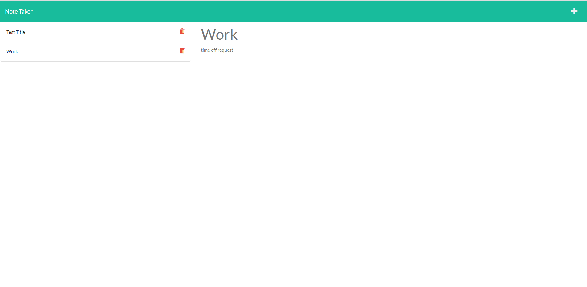

# Note Taker Application

## Overview:

The purpose of this project is to create an interface that allows the user to write and save notes via a basic HTML page. This application relies on Express.js to store and retrieve the note data for the user. Because we use Express.js, all of the JavaScript functionality is written and stored on the back-end side. The Note Taker Application allows you to write, save, and delete notes to keep your tasks organized.

## Sample Display of Project:

## Link to Deployed Application: 

[Note Taker](https://morning-lowlands-64809.herokuapp.com/)
